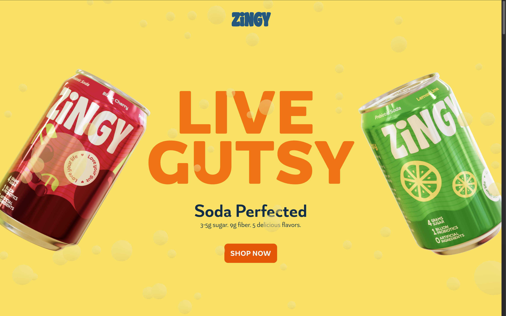

# Zingy

Marketing site for Zingy: a scroll-driven landing experience with 3D content and WebGL scenes (product hero, carousel, and narrative sections).

**Production:** [zingy-drink.vercel.app](https://zingy-drink.vercel.app/)

## Preview



## Stack

- **Application:** Next.js 16 (App Router), React 19, TypeScript
- **Styling:** Tailwind CSS 4
- **3D:** Three.js, React Three Fiber, Drei
- **Animation:** GSAP (ScrollTrigger, `@gsap/react`)
- **State:** Zustand

## Local development

Requirements: Node.js 18 or newer, npm.

```bash
npm install
npm run dev
```

Application: [http://localhost:3000](http://localhost:3000)

### Scripts

| Command         | Description        |
| --------------- | ------------------ |
| `npm run dev`   | Development server |
| `npm run build` | Production build   |
| `npm run start` | Production server  |
| `npm run lint`  | ESLint             |

### Environment

| Variable               | Purpose                                                                                                                                             |
| ---------------------- | --------------------------------------------------------------------------------------------------------------------------------------------------- |
| `NEXT_PUBLIC_SITE_URL` | Canonical origin for Open Graph, sitemap, `robots.txt`, and JSON-LD (e.g. `https://example.com`). On Vercel, `VERCEL_URL` is used if this is unset. |

## Repository layout

- `src/app/` — App Router entry, metadata, sitemap, robots
- `src/components/sections/` — Page sections and layout chrome
- `src/components/scenes/` — R3F scenes wired to sections
- `src/components/` — Shared UI and 3D primitives (e.g. soda can model)
- `public/` — Static assets (HDR environments, textures, fonts, images)

## Deployment

Hosted on [Vercel](https://vercel.com/). Configure `NEXT_PUBLIC_SITE_URL` to the public domain so social previews and discovery URLs stay correct.

## License

Private. All rights reserved.
